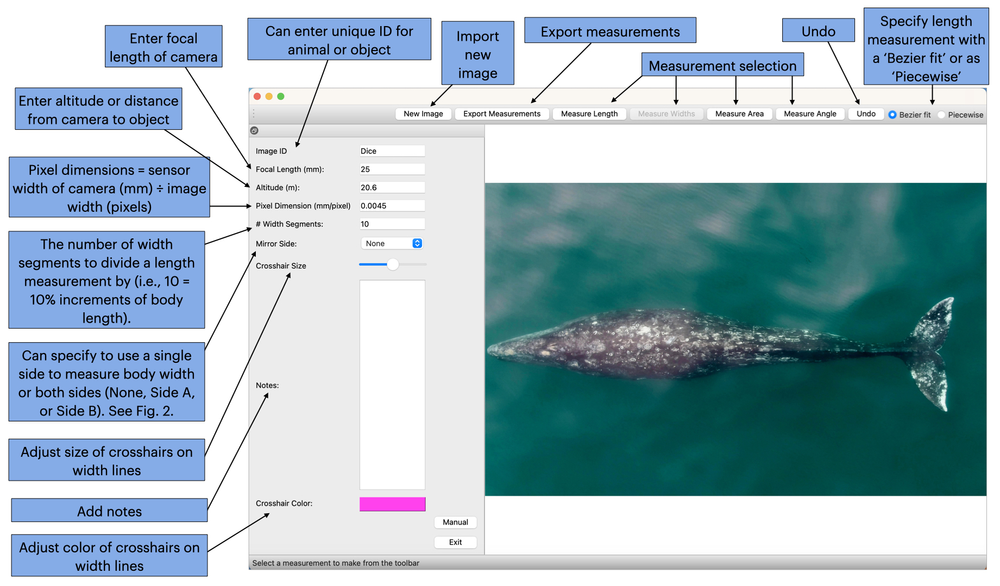

---
title: 'MorphoMetriX version 2: updates to the photogrammetric analysis software'

tags:
  - Python
  - Photogrammetry
  - Morphology
  - Morphometrics
  - Drones
  - Unoccupied aircraft systems

authors:
  - name: Elliott Chimienti
    affiliation: 1
    corresponding: true
  - name: Clara N. Bird
    affiliation: 1
    orcid: 0000-0001-7763-7761
  - name: Walter I. Torres
    affiliation: 2
  - name: KC Bierlich
    affiliation: 1
    orcid: 0000-0001-9724-6055

affiliations:
 - name: Center of Drone Excellence (CODEX), Marine Mammal Institute, Oregon State University, Newport, Oregon, USA
   index: 1
 - name: Applied Physics Laboratory, University of Washington, Seattle, Washington, USA
   index: 2

date: 27 July 2023
bibliography: paper.bib

# Summary

Over the past decade, unoccupied aircraft systems (UAS, or “drones”) have increasingly become prevalent in wildlife sciences for collecting high resolution aerial imagery. In particular, drones provide a more efficient method for non-invasively obtaining morphometric measurements of megafauna. MorphoMetriX is an open-source photogrammetry software developed as a user-friendly graphical user interface (GUI) for customized measurements, including lengths, segmented widths, angles, and areas [@Torres:2020]. Since its release, MorphoMetriX has been used in a variety of drone-based aerial photogrammetry studies on megafauna populations, particularly cetaceans and other marine mammals, related to body length, body condition, morphological relationships, biomechanics and maneuverability, and even detecting pregnancy [@Kahane-Rapport:2020; @Bierlich:2021b; @Bierlich:2021a; @Bierlich:2022; @Stepanuk:2021; @Cheney:2022; @Gough:2022; @Hirtle:2022; @Pallin:2022; @Segre:2022; @Torres:2022; @Cade:2023; @Fernandez Ajo:2023]. Furthermore, the development of MorphoMetriX led to the creation of CollatriX, a software designed to be paired with MorphoMetriX to make processing measurement data easier [@Bird:2020]. CollatriX collates MorphoMetriX outputs into a single data frame and contains functions for calculating a variety of cetacean body condition metrics.

As drones continue to be utilized by wildlife scientists to collect high resolution imagery of megafauna, maintaining accessible and flexible photogrammetry software to stay current with the needs of analysts will help facilitate efficient and robust morphometric analyses to answer novel questions and better monitor populations. Here we present MorphoMetriX version 2 (v2), with new features to significantly improve and enhance usability of the program, measurement efficiency, and data outputs. 

# Statement of need 

MorphoMetriX was designed to overcome limitations of other available photogrammetry software by providing a fast and easy to use GUI with a powerful zoom function to improve accuracy in measurements and the flexibility to make customized length, width, area, and angle measurements with no required knowledge of any scripting language [@Torres:2020]. As MorphoMetriX has continuously been used in various morphometric studies of megafauna, we have incorporated user feedback to ultimately enhance and develop v2 for improved, efficient, and robust measuring. 

# Description of updates

MorphoMetriX v2 can now be downloaded as executable (.exe) and Disk iMaGe (.dmg) files for Windows and MacOS, respectively. The MacOS version is functional for both M1/M2 and Intel chip processors. A link to the detailed manual of MorphoMetriX v2 is also embedded into the GUI and can also be accessed on GitHub (https://github.com/ZappyMan/morphometrix). 

We have improved existing and added several new functions to MorphoMetriX v2 (Figure 1). The ‘Measure Widths’ function automatically divides a length measurement into perpendicular widths based on the designated number of width segments specified by the user (Figure 1, Figure 2). MorphoMetriX v2 now automatically places slidable width points on each perpendicular width line, enabling the user to easily adjust and edit width measurements until satisfied with each placement, whereas in v1 users had to manually click each width point with minimal editing ability. The color and size of the width points can now be customized to help create contrast with the image and ensure the points do not obscure the view of the animal (Figure 2). ‘Mirror Side’ is a new feature that allows users to calculate the body widths of an animal using the edge of the width of one side (A or B) to the center line (Figure 2). This is particularly useful if one of the sides is obstructed, i.e., from glare, refraction, shadows, and greatly increases the number of measurable images available for analysis. The width measurement assumes symmetry between both sides (A and B) and multiplies the selected side by two to get the full width measurement (i.e., width = side A point to center line * 2). The default is “None”, which measures the distance between the edge of the whale from Side A to Side B. The option chosen by the user is reported in the outputted csv. 

MorphoMetriX v2 measurement outputs are now exported in both meters and in pixels and saved in long format csv, for a more interpretable output file that can easily be linked with additional metadata. Finally, if MorphoMetriX v2 crashes, a crash report is automatically generated and saved so that it can be uploaded as an “Issue” report on GitHub to help communicate issues and further improve the program. Ultimately, these changes greatly improve the user experience of MorphoMetriX, increase the available sample size, and improve the error reporting functionality, making this update a valuable and significant change.

# Figures

![Figure 2. Examples of the enhanced “Measure Widths” function, commonly used to measure body condition of megafauna. A) A total body length measurement is automatically divided into perpendicular widths based on the “# Width Segments” designated by the user (here 20 width segments, or 5% increments of the total body length measurement). Slidable width points are then automatically placed on each perpendicular width. B) The user can then slide and adjust each slidable width point to the desired location, in this example to the edge of the whale’s body on both sides. Here, “Mirror Side” is designated as “None” indicating that each perpendicular width is measured as the distance between side A and B. C) In some cases, one side of the whale’s body may be obstructed, i.e., from glare, refraction, shadows, etc., while the other side is clear and easy to identify. In these circumstances, the user can use “Mirror Side” to select the labeled side of the whale that is clearer to identify (in this example Side A). The total body length measurement is assumed to bisect the animal symmetrically, and so the perpendicular width is then measured as the distance from the width point on the specified side to the intersection of the total body length measurement and multiplied by two.](../images/figure2.png)

# Acknowledgements

This work was supported by the Marine Mammal Institute at Oregon State University, the Oregon Gray Whale License Plate Fund, and the Office of Naval Research. Special thanks to all the users and beta testers of MorphoMetriX over the years who have provided positive feedback to help us further improve and develop the program. We also would like thank Dr. Leigh Torres and Dr. David Johnston for project support. Lastly, we would like to acknowledge and express our gratitude to Suzie Winquist for her creative and skillful design of the MorphoMetriX application logo.
